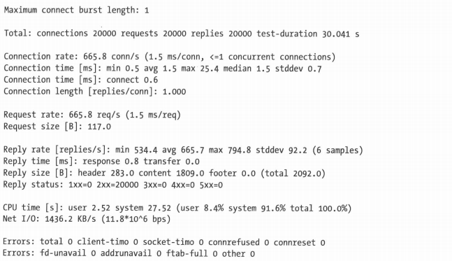
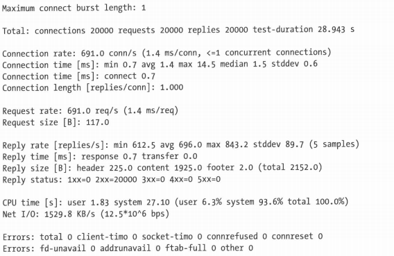

#对网站进行负载均衡
##测试Web服务器的性能
在开始实际提升网站服务器性能之前，你先要知道服务器当前能承受的负载。否则，你怎么知道进行的操作起到了作用？有若干工具和软件可以用来对Web服务器进行基准测试：有些费用颇高，有些则是免费的。有个饱经考验的工具是httperf。你也可以使用Apache自带的ab工具。

httperf是非常强大的Linux命令行工具，可用来建立到服务器的大量连接，以评估服务器的性能。它不仅便于发送各种特定的头（比如Accept-Encoding头），还有一个perl的封装叫做autobench。你可以用autobench来增加每次循环中每秒请求的连接数，还可以将输出写到制表符分割的文件中。后面你可以使用这个文件中的数据绘制图表，用可见的方式来呈现结果（用bench2graph工具来绘制）。

这里，我们用httperf来测试采用安装后默认配置的Apache HTTP和nginx。不需要做任何修改，两个Web服务提供的都是同一份文件：名为index.html的5011字节大小的HTML文件。--num-conns参数会告诉httperf要建立多达20000个到Web服务器的连接。本例中，httperf程序从本地的一台机器访问Web服务器Server02的index.html页面。该服务器也位于同一子网，这样就能排除网络瓶颈带来的影响。

```shell
$ httperf --server Server02 --uri /index.html --num-conns 20000 --add-header='Accept-Encoding: gzip,deflate\n'
```

下面是采用默认配置的Apache HTTP服务器上的index.html进行基准测试的结果：



这里，应答率（Reply Rate）最为重要，因为它能反映出Web服务器每秒能够向客户端发回多少应答。本例中，我们可以看到，它每秒最少能发回534.4个应答，最多能发回794.8个。现在，将它跟同一服务器上的nginx进行对比：



可以看到两者在应答率上有很大的差异：Apache默认配置下的应答率为每秒794.8个，而nginx的应答率高达每秒843.2个。

##加速Apache HTTP
了解了Web服务器性能之后，我们可以开始着手提高响应速度了！在使用诸如负载均衡一类的技术之前，事实上，要提高Web服务的响应速度，我们可以对服务器进行大量重新配置。这不仅包括对整个系统进行的优化，也包括对Web服务器自身进行的优化。

- **禁用空载模块** Apache HTTP沿用了模块化设计，也就是说，服务器系统管理员可以通过加载其他模块来扩展功能。最好禁用那些用不到的模块。
- **禁用DNS查询** 只有在用`Access from`或`Deny from`选项来限制对特定网站或目录的访问时才会用到DNS查询。如果你打算用这两个选项，最好用IP地址而不是域名或主机名，因为每次服务器接收到来自客户端的请求时，DNS查询的累计效应会给性能带来很多影响。
- **采用压缩** 使用HTTP压缩，在发送网站内容前对其进行压缩。使用mod_deflate，一些文件类型经过压缩，只会有大约原来的20%~30%，比如HTML、文本、PHP、XML和其他MIME类型，因此可节省服务器上很大一部分流量。好处在于，接收经压缩数据的客户端不需要任何特定的客户端软件来解压，因为如今的现代浏览器本身就知道如何处理压缩后的内容。
- **FollowSymLinks和SymLinksIfOwnerMatch选项** 

`FollowSymLinks`选项用来在`<Directory>`指令中，可保证网站配置文件中的符号链接可以在该目录下访问。类似地，用来限定只有在目标文件或目录的属主跟链接的属主相同时，才会读取该符号链接指向的文件或目录，因此能提供更高的安全性。

不过，启用`SymLinksIfOwnerMatch`，Apache需要用`lstat`来验证链接的属主和目标目录的属主是否相同。相反，如果没有启用`FollowSymLinks`选项，Apache在访问文件时，需要调用其他的系统调用，因为它需要确定文件是一个“真实文件”还是一个符号链接。

Apache不会缓存`lstat`操作的结果；因此每次请求它都会进行一次这样的操作，这样必然会影响系统的性能。要获得最佳性能，不要使用`SymLinksIfOwnerMatch`选项，并且一定要在`Directory`选项中启用`FollowSymLinks`。

##加速nginx
nginx的默认安装配置几乎没什么提升的空间。毕竟，nginx最开始就是为高性能量身定做的，它的默认配置本身就很高效。不过，有些小技巧可用来对安装进行调整，以匹配服务器的硬件平台，但这跟Apache HTTP服务器上禁用模块不同。

- **`worker_processes`和`worker_cpu_affinity`**

nginx的配置文件允许用户指定`worker_processes`指令。通过这条指令，你能告诉nginx可以创建多少个单线程的进程。为了获得更好的性能，该选项值应该跟服务器的CPU总数或CPU核总数相同。

然而，操作系统很可能会将新的辅助进程也创建在原始进程所在的CPU或CPU核上。必要时，你可以相应地用`worker_cpu_affinity`选项来将这些进程分散到系统的各个CPU或CPU核上。它会将每个辅助进程和特定的CPU核绑定。

`worker_cpu_affinity`会将CPU上的二进制位掩码作为一个选项，其中最低位的位掩码代表第一个逻辑CPU，最高位的位掩码代表最后一个逻辑CPU。举个例子，如果系统上有4个CPU，你可以将亲和性设为如下值：

```txt
worker_processes 4;
worker_cpu_affinity 0001 0010 0100 1000;
```

如果有八个CPU，下面的配置就会设置好亲和性：

```txt
worker_processes 8;
worker_cpu_affinity 0001 0010 0100 1000 10000 100000 1000000 10000000;
```

修改后，你需要重启nginx。你可以用`ps`和`taskset`组合起来确认每个辅助进程正运行在哪个CPU上。

- **Gzip压缩**

跟Apache HTTP类似，nginx也支持传送数据前对数据进行压缩。这里有两个方便的模板：gzip模块和gzip预压缩模块，两者可以同时启用。gzip模块默认会编译，除非在包配置过程中用`--without-http_gzip_module`明确排除。自动压缩可以在nginx配置文件的`http{}`部分用`gzip`指令启用。

```txt
http {
	gzip on;
}
```

压缩等级也可以在配置文件中用`gzip_comp_level`指令指定。`gzip_comp_level`指令可以接受1到9之间的整数，其中1代表最低压缩等级，9代表最高压缩等级。默认情况下，`gzip_comp_level`值为1。

跟Apache HTTP的情况一样，你需要在压缩等级和压缩哪些文件类型，以及给哪些浏览器进行压缩之间权衡。记住，压缩会给服务器带来额外负载，所以，你应该避免压缩那些压缩效果很小的文件，比如图片、音乐、PDF文件等。

默认情况下，除文本/HTML之外的文件类型都不会被压缩。当然，这是可以修改的：可以使用`gzip_types`指令添加其他MIME类型。

```txt
http {
	gzip on;
	gzip_comp_level 3;
	gzip_types application/javascript application/xml;
}
```

采用压缩的最大问题是压缩过程中造成的额外服务器负载。虽然这部分负载跟减少的连接时间大体上相互抵消了，但整个过程都是CPU密集的。nginx提供了一个额外的模块，称作`gzip_static`。它允许nginx查找要发送的数据的压缩版本，因此能够避免每次处理请求时重复压缩相同数据。`gzip_static`模块可以在nginx配置文件`http{}`部分中通过`gzip_static`指令启用。

```txt
http {
	gzip_static on;
}
```

一旦有请求进来了，nginx会在源文件同一位置查找`.gz`文件，并发出该文件。其中，对于动态内容要现场压缩，这可以通过`gzip`模块实现。我们建议对这部分数据采用较低的压缩等级，从而保证服务器性能不用受太大的影响。

```txt
http {
	gzip on;
	gzip_static on;
	gzip_comp_level 2;
	gzip_types application/javascript application/xml;
}
```

##对Web服务器进行负载均衡
将负载均衡加入到综合体中，不仅降低了Web服务器的整体负载，还能在某台Web服务器临时宕机时方便地做失效备援。

本例中，我们将假定已经搭建好了前面提到的环境：两台Web服务器在Linux操作系统上运行着优化过的Apache或nginx，另外有一台负载均衡服务器运行着IPVS。IPVS是Internet Protocol Virtual Server的缩写，用于均衡服务器的负载。

在前端，负载均衡器将会接收所有入向连接。也就是说，如果你用端口转发，连接必须转发到这台服务器。类似地，人们连接的都是服务器LoadBalancer的外连IP。负载均衡器，即定向器，会基于权重最小连接（Weighted Least Connection，WLC）调度方法将这些负载分发给所有Web服务器，也就是工作服务器。

##划分动态和静态内容
通过nginx的方向代理模块，将动态内容和静态内容划分开来。这样，nginx就能够将特定MIME类型的入向请求转发给其他服务器。最终，你可以将nginx用作提供静态内容（如HTML页面、图片文件、CSS文件等）的前端服务器，而将动态数据（比如PHP生成的内容）的请求转发给后端运行的Apache服务器。这么做，你可以获得两者的好处：用nginx来处理预压缩的静态数据，用Apache来处理网站的动态数据。

反向代理模块配置起来比较容易。一旦Apache HTTP在Web服务器上运行起来，并且能够处理PHP内容了，你就可以修改网站特定的配置文件，告诉nginx该转发哪些请求以及转发给谁了。你要将以下内容添加到`server{}`指令中：

```txt
location ~ \.php$ {
	proxy_pass http://10.0.0.4;
	proxy_set_header X-Real-IP $remote_addr;
	proxy_set_header X-Forwarded-For $proxy_add_x_forwarded_for;
}
```

这段代码通过`proxy_pass`指令，告诉nginx将针对所有位置的`.php`文件请求转发给内网IP为`10.0.0.4`的Web服务器。你也可以让nginx通过`proxy_set_header`指令，来修改发送给Apache服务器的请求头。