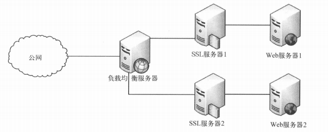
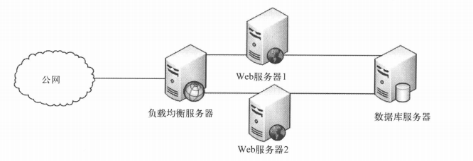

#使用集群提高可用性
现代IT系统最常用的衡量标准之一是可用性服务等级协议（Service Level Agreement，SLA），它约定了IT服务每年需要保持一定的可用时间。通常，它会指出服务器每年需要在多长时间（即在线时间，uptime）内能正常工作、保持可用——一般会定义为一年内的百分比。

最常见的三个在线时间标准是99.9%、99.99%和99.999%；它们也分别被通俗地表述为3个9、4个9和5个9。这些标准要求网站在整年的不间断运行中离线时间不超过：

- 3个9：8.76小时
- 4个9：52.56分钟
- 5个9：5.26分钟

##可用性
从字面意思就能看出高可用性的含义：指服务器几乎总是针对特定用途保持可用。高可用性有时也指创建具备高可用能力的服务器的方法。

未达到某个可用性等级的主要原因是，在给定的恢复Web服务器某组件的时间内未能完成恢复。这也就是说，跟所有高可用性系统一样，我们的目标是，即使系统的某部分出现了故障，系统依然能够工作。达到这个目标的主要途径就是通过冗余——准备一个备用系统来接管。在一些更高级的例子中，这些都会自动实现。到目前为止，我们采用负载均衡的主要优势之一在于，你已经通过搭建的共享负载的服务器的形式实现了冗余。

IPVS系统意味着如果某台服务器关闭了，你只需临时将它从IPVS的服务器列表中删除就又能正常工作了，只是容量低了一点。你能发现，使用负载均衡的架构较单台服务器架构而言，优势非常明显。如果某台服务器挂掉了，你可以继续在另一台服务器上处理该服务器的负载。这个概念我们称为故障恢复（Fail Over），它是高可用性中涉及的主要原则之一。

##单一故障点
为了实现服务器上的高可用性，你需要对系统进行特殊配置，以达到所有系统都有冗余的目的。在这些例子中，你要注意的问题称为单一故障点（Single Point of Failure）；它是个单一系统，如果它出现了故障，整个系统都会无法工作。系统冗余这种处理方法原则上容易做到，但有时有一些注意事项。

在这个结构中，只有一个单一故障点：负载均衡服务器。因为即使某一SSL服务器或Web服务器关闭了，另外一对服务器仍能工作。现在，看看下一个设计。

在本例中，有两个单一故障点：负载均衡器，跟前面一样；数据库服务器，这次引入的。这个的原因是，如果任何一台Web服务器挂掉了都没问题。但如果数据库服务器挂掉了，两台Web服务器就都无法工作。因为数据库服务器在同时为两台Web服务器提供数据。

单一故障点的解决方法不止简单的服务器冗余，可以更深入一些。复杂的系统现在甚至都配备了两个独立的网络接入，甚至是两个完全独立的电源。更重要的是，它们还尝试用“物理分离”的方式搭建这些系统来进一步扩展。这些工作都是为了保证没有某个关键资源的两个冗余源会占用同一空间：网线、电线一类都会通过不同的路径来连接源和目标。通常，这会造成整个大楼的两侧布有两套线缆。如果某组线缆被意外截断了，位于其他位置的另外一组线缆仍能正常使用。

##集群化
集群化是指创建一组用于相同用途的服务器：分担负载，以及在某个集群成员出现故障时，由其余成员来处理该成员的负载。集群可以是多态服务器上执行相同功能的一组应用，或是组内其他服务器遇到故障时，能够接管所有负载的一组服务器。

使用集群来提高可用性跟其他常用方法的不同之处在于，它的目的是通过正在使用的系统来提供高可用性。

提供高可用性的另一途径称作备用模式（Standby Mode）。它是在原始服务器出现故障时，通过一台备用服务器来接管这些负载。这台服务器可以是冷状态（关机状态，等待激活和分配）、暖状态（运行状态，但需要启用它要接管的应用程序）或热状态（跟要替换的服务器并行工作，在需要时可以直接即时接管）。不难想象，冷备用服务器要比暖备用或热备用少见，但它的成本也显然更低。尽管热备用在出现故障时非常有用，但一台“以防万一”用的服务器消耗的能量也非常浪费。

##IPVS故障恢复
创建集群时，你还要解决三个问题。第一点，你需要自动化方式来创建虚拟服务器时，指定要用哪些服务器。有个专门和IPVS搭配工作的守护进程就是以这种方式设计的，名为ldirectord。当服务器出故障或停止响应HTTP请求时，它会去修改IPVS表。

第二点，你可能已经注意到，IPVS使用的负载均衡器明显是个单一故障点。如果该负载均衡服务器停止了工作，你就无法访问网站。

解决办法就是引入故障恢复服务器，在负载均衡服务器出现故障时替代它。除了增加故障恢复服务器，你还需要一种机制来允许备用负载均衡服务器监测主负载均衡服务器上是否出现故障，然后接管所有负载。这个应用称为heartbeat。它会同时跟两台负载均衡服务器保持联系，一旦出现了故障，备用服务器就会接管。

我们还有一个问题没提。维护两台负载均衡服务器，就意味着你需要两个负载均衡服务器IP地址。尽管在这里我们将它列为一个问题，但它是集群中很常见的一部分。因为如果连到外网的那台服务器在这时出现了故障，整个集群就都无法访问了。

解决这个问题的方案称为虚拟IP地址，其在任意时间尅属于任意一台服务器；集群中，拿到该虚拟IP地址的那台服务器会代表整个集群连接到外网。也就是说，你可以将所有的入向、出向连接都指向该虚拟IP地址，而它总会担当整个集群的接入点。